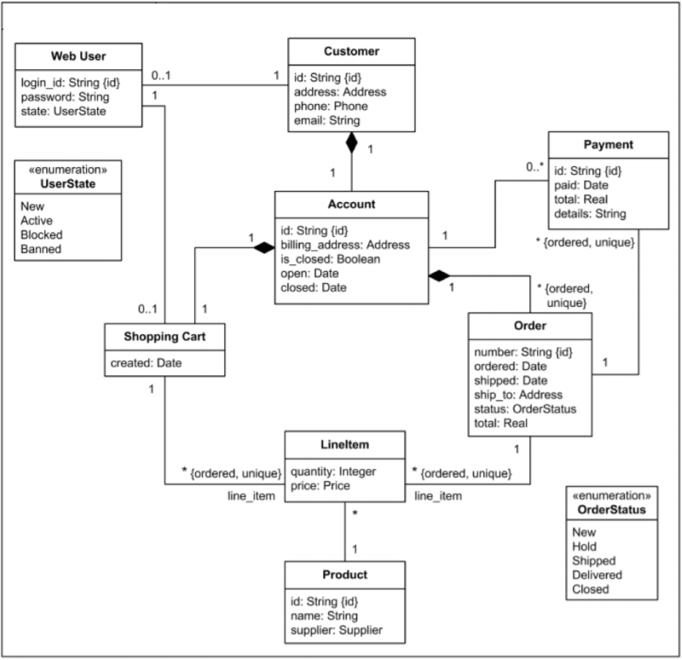

# Java Program created from UML Diagram
CSUEB CS-401 Software Development SP2019

### Notes
- White and Black Box test cases are located in main.java

### Assignment Instructions:
#### PART 1 Create a Java program from the UML class diagram.

- Each customer has unique id and is linked to exactly one account.
- Account owns shopping cart and orders.
- Customer could register as a web user to be able to buy items online.
- Customer is not required to be a web user because purchases could also be made by
phone or by ordering from catalogues.
- Web user has login name which also serves as unique id.
- Web user could be in several states - new, active, temporary blocked, or banned, and be
linked to a shopping cart.
- Shopping cart belongs to account.
- Account owns customer orders.
- Customer may have no orders.
- Customer orders are sorted and unique.
- Each order could refer to several payments, possibly none.
- Every payment has unique id and is related to exactly one account.
- Each order has current order status.
- Both order and shopping cart have line items linked to a specific product.
- Each line item is related to exactly one product.
- A product could be associated to many line items or no item at all.
Demonstrate the functionality and features using a command-line interface. No GUI or
database connectivity is required. You may use any technique to store the temporary data used
in the program. You may also be creative and add more features if you wish. Do not change the
theme of the program.

#### PART 2: Traceability and Testing
- Comment in the source code to identify where all features are implemented. Note: You
don’t need to use a numbering system, but you may optionally provide a traceability
matrix and/or add a numbering system for the features and comments.
- Provide Black Box test cases for ALL features of the implementation. You should have a
minimum of 20 test cases and include full coverage testing. That is, you need to test ALL
features of the system at least once. Note: You don’t need to actually perform the black
box testing of the system.
- Provide White Box testing for at least one of the class objects. Provide coverage for all
methods of the object. You may use Junit or another automated test generation
technique. You may also provide a written test procedure or create a source code test
case by hand. The While Box testing should cover the functionality of at least one of the
class objects in the system. Normally, you would create them for all but that is not
required for this assignment. Select one approach manual or automated since you are
not required to do both.
